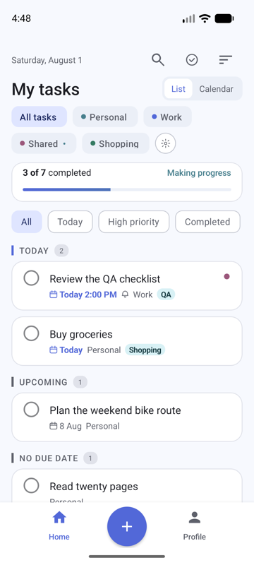
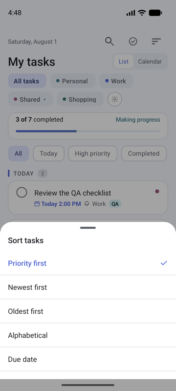
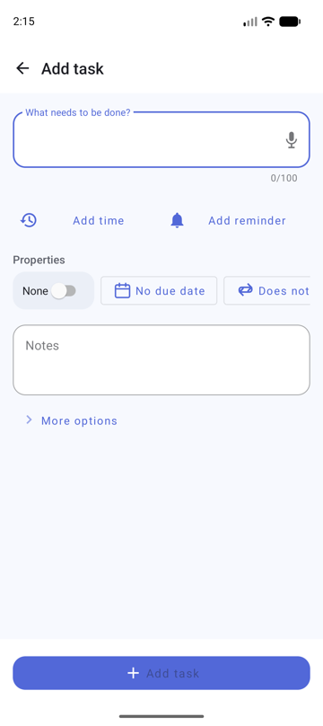
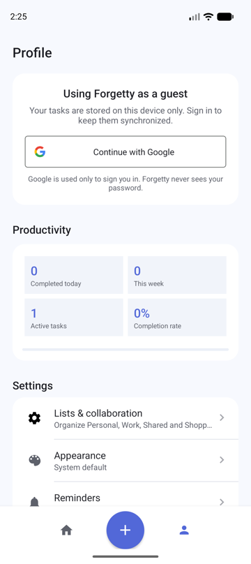

# Forgetty Android

Forgetty is a native Kotlin todo application built with Android Views, Material Components,
Fragments, Room, Firebase Authentication, and Firestore. It works locally in guest mode and
switches to user-scoped cloud storage after sign-in.

This repository also contains the **Agentic Mobile QA Lab** — an agentic engineering workflow
for mobile QA automation built around this app. See [Documentation](#documentation).

## Screenshots

Screenshots use emulator-only fixture data; production builds do not include hardcoded sample tasks.

<table>
  <tr>
    <th>Home</th>
    <th>Sort tasks</th>
    <th>Add task</th>
    <th>Profile</th>
  </tr>
  <tr>
    <td></td>
    <td></td>
    <td></td>
    <td></td>
  </tr>
</table>

## Documentation

### Testing

| Document | Covers |
|---|---|
| [Maestro UI tests](maestro/README.md) | CLI-only Maestro smoke suite, selectors, determinism hazards, how to run |
| [Espresso / instrumented tests](app/src/androidTest/README.md) | 44 instrumented tests, Allure reporting, test isolation |
| [Quality gates](docs/quality-gates.md) | the evidence standard, `IMPLEMENTED` vs `VERIFIED`, exit-code contract |
| [Regression flows](maestro/regression/README.md) | what belongs in the regression suite, and what does not |

### Agentic QA workflow

| Document | Covers |
|---|---|
| [Agentic Mobile QA Lab](docs/agentic-qa-lab.md) | overview: agents, skills, workflow, interview talking points |
| [Architecture](docs/architecture.md) | diagrams: agent loop, test levels, gate pipeline |
| [Agent workflow](docs/agent-workflow.md) | a real end-to-end trace, including a failure and its fix |
| [Demo scenario](docs/demo-scenario.md) | how to reproduce a failure-and-recovery demo on demand |
| [Hook behaviour](.claude/README-hooks.md) | exactly what the PostToolUse hook checks |
| [CLAUDE.md](CLAUDE.md) | the project instructions every agent reads first |

## Features

- List and calendar Home modes with localized dates and first-day-of-week support.
- Smart Overdue, Today, Upcoming, No due date, and Completed sections.
- Search across task titles, notes, tags, and list names.
- All, Today, High priority, and Completed filters.
- Priority, newest, oldest, alphabetical, and due-date sorting.
- Personal, Work, Shared, Shopping, and custom task lists.
- Progress summaries calculated from the current task scope.
- Swipe reveal, first-tap deletion, retry, and Undo.
- Full Add Task experience with notes, reminders, recurrence, tags, subtasks, attachments, list selection, voice entry, and local suggestions.
- Editable Task Detail bottom sheet with autosave state, completion, duplication, sharing, and deletion.
- Guest mode backed by Room and authenticated mode backed by user-scoped Firestore.
- Google sign-in through Firebase Authentication and Android Credential Manager.
- Safe guest-task import after sign-in.
- System, light, and dark appearance settings.
- Native notification reminders, launcher shortcuts, task export, and `RemoteViews` home-screen widgets.
- Accessibility-friendly touch targets, descriptions, semantic state labels, and dynamic text layouts.

## Architecture

The project keeps the existing Activity, Fragment, RecyclerView, repository, and data-source architecture:

```text
app/src/main/java/com/si13/forgetty     Kotlin application code
app/src/main/res                   XML layouts, themes, drawables, widgets
app/src/test                       Unit tests
app/src/androidTest                Espresso and Room migration tests
app/schemas                        Exported Room schemas
maestro/                           Maestro UI test flows
.claude/                           agents, skills and hooks for the QA workflow
scripts/                           build, test and evidence-collection scripts
```

Important components:

- `MainActivity` hosts navigation, the centered Add action, and extension deep links.
- `HomeFragment` owns list/calendar presentation, search, filters, sorting, sections, and swipe behavior.
- `TaskRepository` selects guest or authenticated storage and coordinates task mutations.
- `LocalTaskDataSource` stores guest tasks in Room.
- `RemoteTaskDataSource` stores authenticated tasks in Firestore.
- `TaskReminderScheduler` schedules and handles native reminder notifications.
- `ForgettyWidgets` supplies compact, Today-list, and progress widgets.
- `AuthRepository`, `GoogleAuthClient`, and `GoogleSignInHandler` preserve the real sign-in flow.

## Data model

Tasks support completion timestamps, high priority, due date and time, notes, reminders, recurrence, lists, tags, subtasks, attachment references, location-reminder metadata, and assignees.

Room uses an explicit version 4 to 5 migration; existing rows remain readable. Firestore parsing supplies safe defaults for fields missing from older documents. Guest tasks are not deleted until a remote batch import succeeds.

Attachments currently use Android system-picker URI references. Cross-user collaboration and remote attachment uploads require application-specific Firestore rules and Firebase Storage ownership policies before they can be enabled safely.

## Build and test

Use the checked-in Gradle wrapper:

```bash
./gradlew testDebugUnitTest
./gradlew assembleDebug
./gradlew assembleDebugAndroidTest
./gradlew lintDebug
./gradlew connectedDebugAndroidTest
```

The debug APK is generated at:

```text
app/build/outputs/apk/debug/app-debug.apk
```

Convenience wrappers that add device checks, artifacts and honest exit codes:

```bash
scripts/check-environment.sh    # git, java, adb, maestro + connected devices
scripts/build-android.sh        # ./gradlew assembleDebug with a saved log
scripts/run-smoke.sh            # the Maestro smoke suite
scripts/verify-results.sh       # every quality gate: PASS / FAIL / SKIPPED
```

### Test levels

| Level | Location | Count | Runs on |
|---|---|---|---|
| Unit (JVM) | `app/src/test/` | 12 classes | no device |
| Instrumented ([docs](app/src/androidTest/README.md)) | `app/src/androidTest/` | 5 classes, 44 tests | device |
| UI end-to-end ([docs](maestro/README.md)) | `maestro/smoke/` | 3 flows | device |

Most coverage sits at the lowest level on purpose. See [docs/quality-gates.md](docs/quality-gates.md).

## Continuous integration

| Workflow | Trigger | Does |
|---|---|---|
| [`espresso.yml`](.github/workflows/espresso.yml) | PR, push to main, manual | boots an emulator, runs `connectedDebugAndroidTest`, publishes an Allure report |
| [`mobile-tests.yml`](.github/workflows/mobile-tests.yml) | PR, push to main, manual | build, unit tests, static validation of flows/agents/skills; **opt-in** emulator + Maestro job |

## Firebase configuration

Firebase is configured through `app/google-services.json`. Google sign-in requires a valid `default_web_client_id` generated from that Firebase project.

Firestore task documents remain scoped to the authenticated user. Do not enable cross-user shared lists without corresponding ownership, membership, invitation, rules, and index changes.
