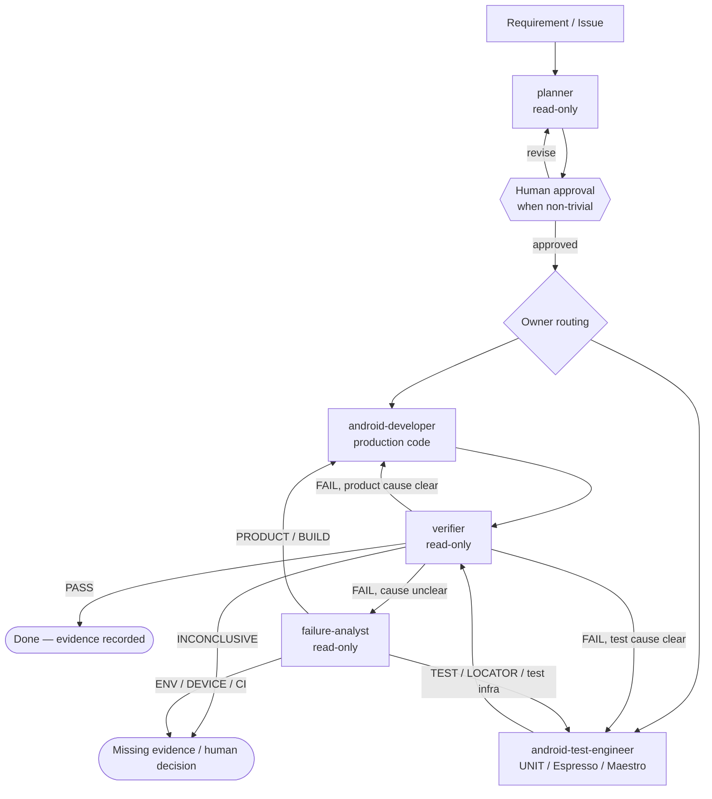
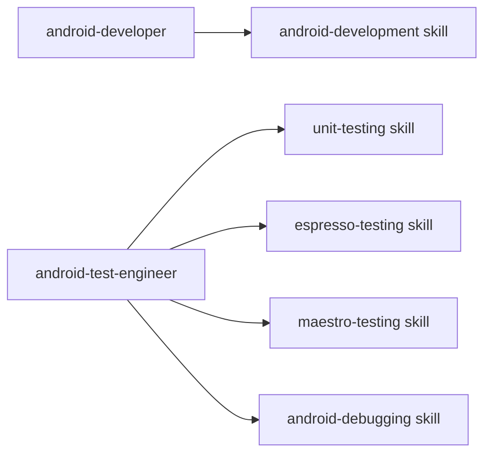
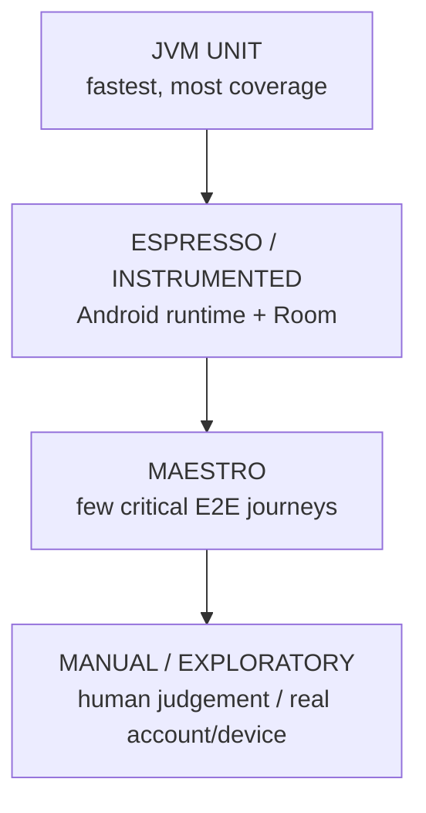
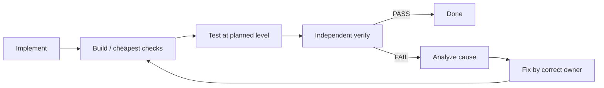

# Architecture — Agentic Android Engineering Harness v2

## Role-based topology



The main Claude Code session is the orchestrator. It routes work; it does not need to be a
sixth agent until orchestration becomes an independently complex responsibility.

## Why these boundaries

| Role | Can edit? | What it owns | What it cannot do |
|---|---:|---|---|
| `planner` | no | requirement, impact, risks, test strategy, owner routing | implement |
| `android-developer` | yes | production app behavior | approve itself, own test suite by default |
| `android-test-engineer` | yes | automated tests and test infra | change product behavior silently, approve itself |
| `verifier` | no | independent final evidence | repair what it verifies |
| `failure-analyst` | no | root-cause classification and routing | make red disappear by editing |

This separation is about **authority**, not job titles. The verifier's inability to edit and
the implementers' inability to issue PASS are intentional guardrails.

## Technology belongs in skills



A new test framework should normally add or change a skill, not add another agent.

## System under test

```text
app/
├── src/main/          native Kotlin + XML app
├── src/test/          JVM/unit tests
├── src/androidTest/   Espresso/instrumented/Room tests
└── schemas/           exported Room schemas
```

Forgetty uses Activities/Fragments, Room for guest data, Firebase Auth and Firestore for
signed-in data. The harness wraps the real application rather than a test-only toy.

## Test-level architecture



The planner chooses the lowest reliable level. The test engineer implements that level. The
verifier checks that the chosen test actually proves the acceptance criterion.

## Harness layers

```text
LLM / Claude Code
      │
      ▼
Project instructions + agent roles + dynamic skills
      │
      ▼
Tools: Git / Gradle / adb / emulator / Espresso / Maestro
      │
      ▼
Hooks + deterministic scripts + CI quality gates
      │
      ▼
Evidence: exit codes / JUnit / Allure / screenshots / logcat / artifacts
      │
      ▼
Independent verifier + failure feedback loop
```

## Quality loop



No path reaches Done without the verifier.

## Known determinism hazards

1. Signed-out cold launch displays the login bottom sheet.
2. Debug builds may seed ~100 tasks asynchronously after state clear.
3. Device/emulator availability is an environmental fact, not a test result.

The harness treats unavailable device evidence as skipped/unverified, never as success.
