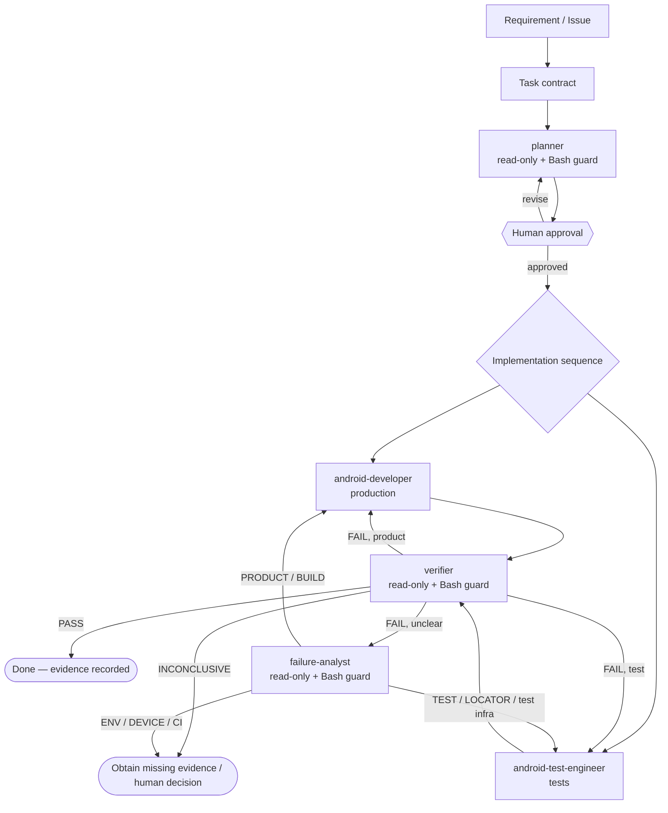
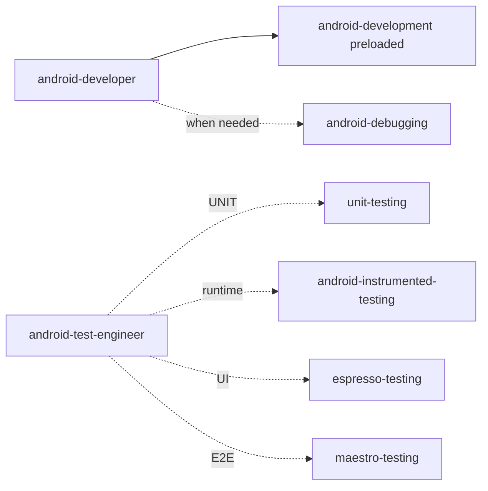
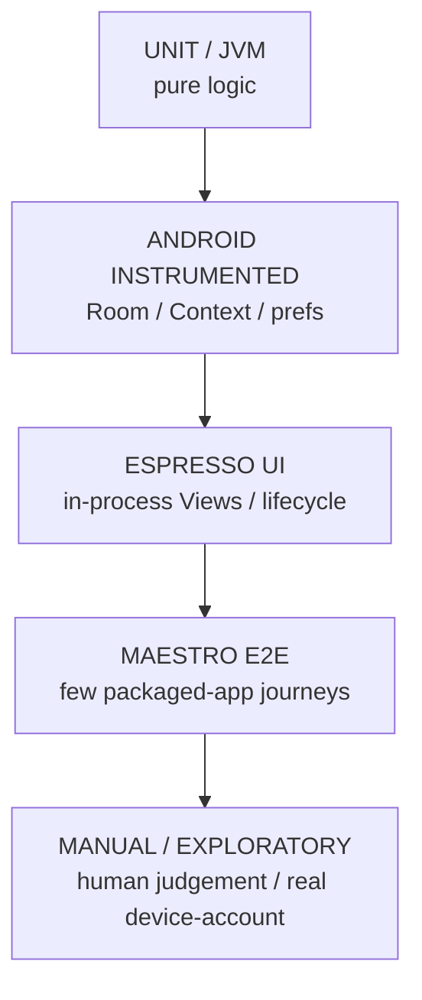

# Architecture — Agentic Android Engineering Harness v2

## Responsibility topology



The main Claude Code session orchestrates via `/change`; it is not a sixth implementation role.

## Why these boundaries

| Role | Source edits? | Owns | Cannot do |
|---|---:|---|---|
| `planner` | no | requirement, impact, risk, test strategy, file ownership, sequencing | implement/build |
| `android-developer` | yes | production behavior | own tests by default / approve itself |
| `android-test-engineer` | yes | automated tests and test infra | silently change product / approve itself |
| `verifier` | no | independent evidence/final verdict | repair work it verifies |
| `failure-analyst` | no | root-cause classification/routing | edit until red disappears |

Read-only roles omit Write/Edit **and** use scoped `PreToolUse` Bash hooks. This closes the gap
where an agent could otherwise mutate source/history through shell despite a textual rule.

## Contract-based handoff

Non-trivial runs use `artifacts/agent-runs/TASK-*/`:

```text
requirement.md
plan.md
approval.md
developer-report.md      optional
 test-report.md           optional
verification.md
failure-analysis.md      on diagnostic loop
summary.md               on PASS
```

Subagents have isolated contexts. The contract is the precise handoff boundary; conversation
summaries are not the canonical spec. See `docs/task-contract.md`.

## Dynamic skills



Framework-specific skills are invoked through `Skill` only when the planned level needs them.
A new framework normally changes/adds a skill, not an agent.

## Test-level architecture



The planner chooses the lowest reliable level. `android-test-engineer` loads only the skill(s)
for that level. The verifier asks whether the selected test would actually fail on the target
regression.

## Sequencing

```text
TEST_FIRST     regression test → product → verify
PRODUCT_FIRST  product/testability → test → verify
PARALLEL       dev || test only with disjoint files/stable contract
TEST_ONLY      test → verify
PRODUCT_ONLY   product → manual/other planned evidence → verify
```

One task has one owner per file. Shared Gradle/config files are never edited concurrently by
both implementers.

## Harness layers

```text
Claude Code / LLM
      │
CLAUDE.md + /change workflow + task contract
      │
5 role agents + just-in-time skills
      │
PreToolUse policy hooks + PostToolUse quick checks
      │
Git / Gradle / adb / emulator / Espresso / Maestro
      │
scripts/validate-harness.sh + scripts/verify-results.sh + CI
      │
JUnit / Allure / screenshots / logcat / artifacts
      │
independent verifier + failure feedback loop
```

Static harness policy has one executable source of truth: `scripts/validate-harness.sh` is
called locally and from PR CI.

## System under test

```text
app/
├── src/main/          native Kotlin + XML app
├── src/test/          JVM/unit tests
├── src/androidTest/   Android instrumented/Espresso/Room tests
└── schemas/           exported Room schemas
```

Forgetty uses Activities/Fragments, Room for guest data, Firebase Auth and Firestore for
signed-in data.

## Known determinism hazards

1. Signed-out cold launch displays the login bottom sheet.
2. Debug builds may seed ~100 tasks asynchronously after state clear.
3. Device/emulator availability is an environmental fact, not a passing test.

Unavailable required evidence produces `INCONCLUSIVE`/`INCOMPLETE`, never PASS.
