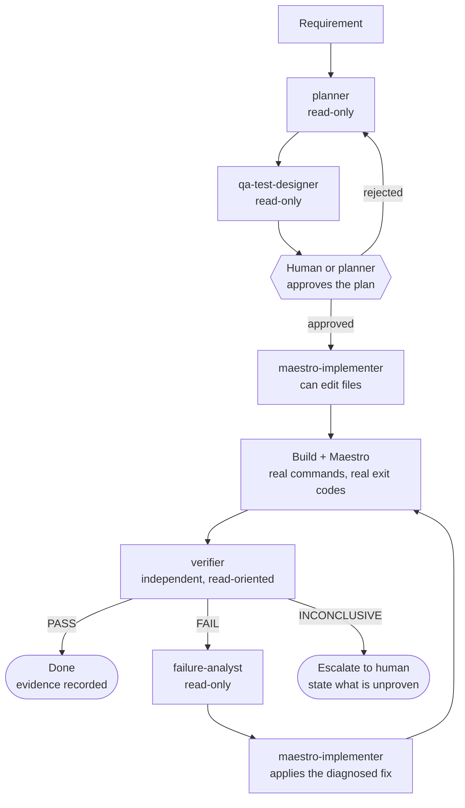
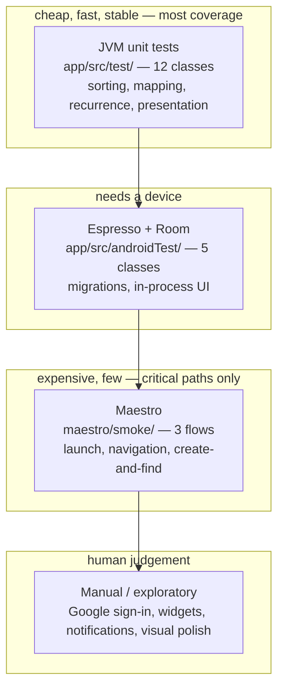
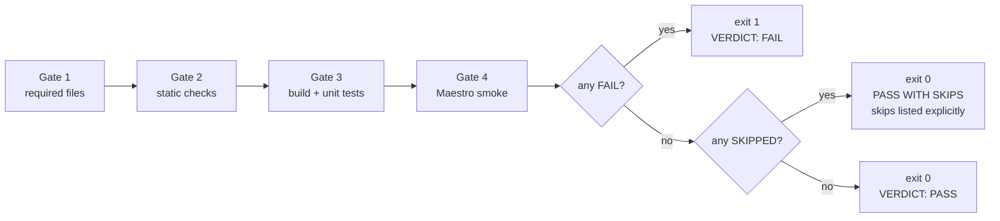

# Architecture

## The agent workflow



The loop that matters is `verifier → failure-analyst → implementer → build/test → verifier`.
Nothing exits to `Done` except through the verifier.

## Why the roles are separated

An agent that writes code and then judges it will grade generously. It is not lying — it
genuinely believes the code is right, because the same reasoning produced both the code and
the assessment. The mistake and the review share a root cause.

Separating the roles breaks that shared cause:

| Role | Sees | Cannot | So it cannot |
|---|---|---|---|
| `planner` | the requirement, the repo | edit files | bias implementation toward what is easy to test |
| `qa-test-designer` | the requirement, the risk | edit files | quietly drop hard scenarios once coding starts |
| `maestro-implementer` | the plan | declare success | mark its own homework |
| `verifier` | requirement + diff + real output | edit files | fix a problem instead of reporting it |
| `failure-analyst` | logs, diffs, device state | edit files | reach for a sleep or a retry to make red go away |

The two "cannot" columns are the whole design. The implementer is denied the *authority* to
approve; the verifier is denied the *ability* to fix. Neither can collapse the loop.

## System under test

The QA layer wraps a real application. It is not a toy built to make the tests pass.

```
si13/
├── app/                       Forgetty — Kotlin Android app (the system under test)
│   ├── src/main/java/         43 Kotlin files: Activities, Fragments, Room, Firestore
│   ├── src/main/res/layout/   XML layouts — the source of stable test ids
│   ├── src/test/              12 JVM unit test classes  <- most coverage lives here
│   └── src/androidTest/        5 Espresso + Room migration test classes
│
├── .claude/                   the agentic layer
│   ├── agents/                5 subagents with separated authority
│   ├── skills/                5 skills: project knowledge, loaded on demand
│   ├── hooks/quick-check.sh   PostToolUse: cheap static checks after every edit
│   └── settings.json          hook wiring
│
├── maestro/                   UI automation (CLI only)
│   ├── common/                reusable runFlow fragments
│   ├── smoke/                 3 critical-path flows
│   └── regression/            deeper suite, opt-in, currently by-design empty
│
├── scripts/                   the executable quality gates
├── artifacts/                 all run evidence (gitignored except .gitkeep)
├── docs/
└── .github/workflows/
    ├── mobile-tests.yml       build + static validation, opt-in emulator job
    └── espresso.yml           pre-existing Espresso + Allure run
```

## Where each test level lives



The shape is deliberate. Three Maestro flows against twelve unit test classes is the
correct ratio, not a gap: UI tests cost the most to write, run, diagnose and maintain, so
they are spent only where nothing cheaper can prove the requirement.

## Quality gates as code

`scripts/verify-results.sh` is the gate. It reports `PASS` / `FAIL` / `SKIPPED` per gate and
never converts a skip into a pass.



Gate 2 enforces the repo's own rules mechanically — no `sleep:` and no coordinate `point:`
anywhere in `maestro/`. A documented rule nobody checks is a suggestion.

## The two determinism hazards, made explicit

Both are properties of the real app, discovered by reading it rather than by a test flaking
in CI later:

1. **Login bottom sheet on every cold launch while signed out** (`MainActivity.onCreate`).
   Handled once, in `maestro/common/launch-fresh.yaml`.
2. **~100 demo tasks seeded asynchronously after a data clear on debuggable builds**
   (`MainActivity.seedDebugTasksIfNeeded`). Handled by never asserting on counts or seeded
   titles, and by creating uniquely-titled data per run.

Naming a hazard is what lets you design around it. The alternative is a flaky suite and a
retry count that grows every quarter.
